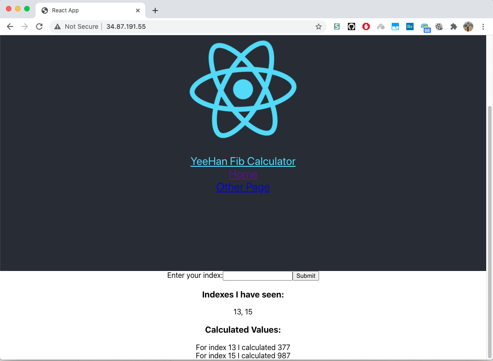
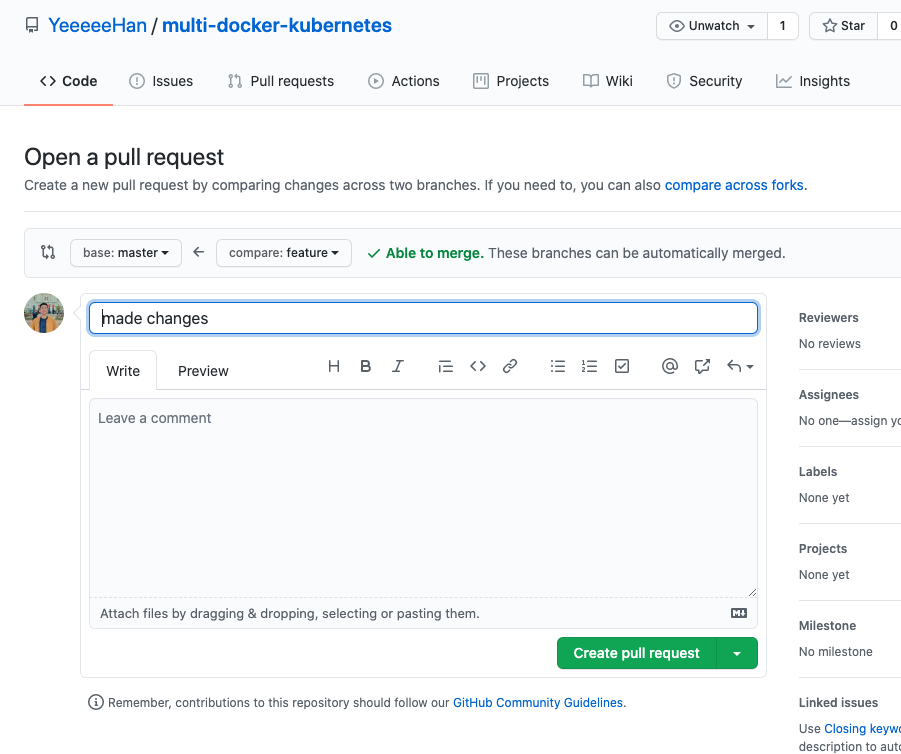
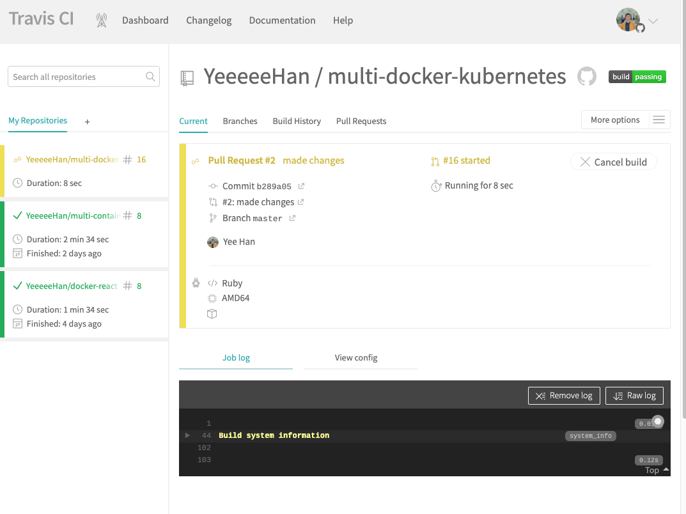
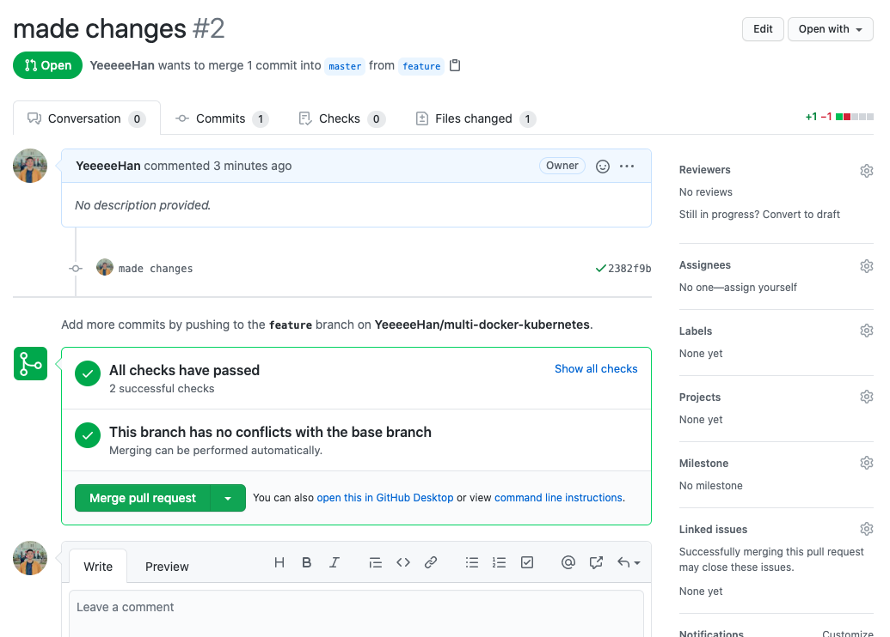
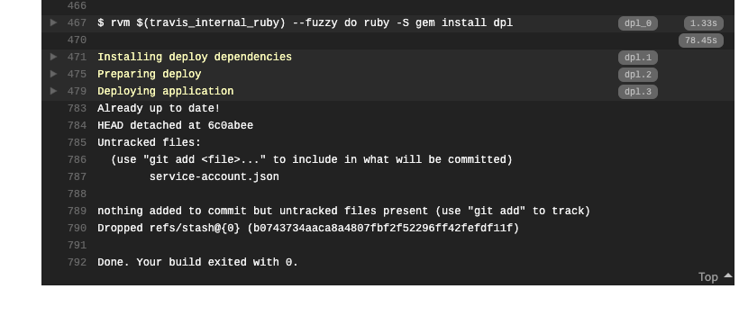
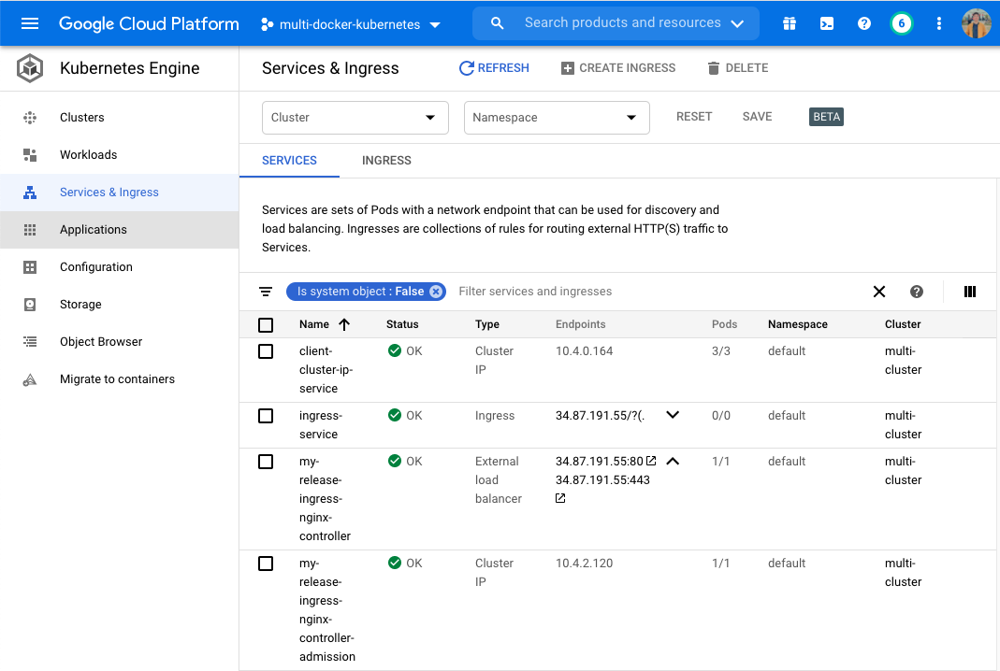
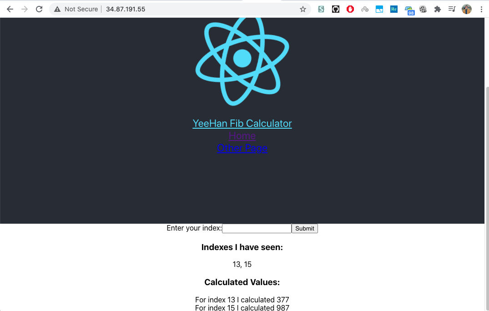

<!-- TABLE OF CONTENTS -->
## Table of Contents

* [About the Project](#about-the-project)
  * [Workflow](#workflow)
  * [Built With](#built-with)
* [Local development workflow](#Local-development-workflow)
  * [1. Prerequisites]
  * [2. Running Locally]
* [Deployment workflow](#Deployment-workflow)
  * [1. Commit and Push to feature branch]
  * [2. Create PR - Travis CI tests triggered]
  * [3. Merge PR]
  * [4. Travis CI deployment - Deployment to GKE]
* [Contact](#contact)

<!-- ABOUT THE PROJECT -->
## About The Project



This is my first experience with Docker and Kubernetes, and is a project that is done in conjunction with a [Udemy course](https://www.udemy.com/course/docker-and-kubernetes-the-complete-guide/) that I enrolled in October 2020.
The main focus of the project is to build a custom CI/CD pipeline with Github, Travis-CI and Google Kubernetes Engine to facilitate local development and automated deployments.


### Workflow:
* Make changes to source code
* Commit to Feature branch
* Create PR - Trigger Travis CI tests
* When Travis CI tests pass, merge to Master Branch - Trigger Travis CI deployment script
* Deployment to GKE


### Built With
This section should list any major frameworks that you built your project using. Leave any add-ons/plugins for the acknowledgements section. Here are a few examples.
* [Github](https://github.com/)
* [Travis-CI](https://travis-ci.org/)
* [Docker](https://www.docker.com/)
* [Kubernetes](https://kubernetes.io/)
* [Google Kubernetes Engine](https://cloud.google.com/kubernetes-engine)


<!-- GETTING STARTED -->
## Local development workflow

To get a local copy up and running follow these simple example steps.

### 1. Prerequisites

Install minikube
```sh
brew install minikube
```

Start kubectl
```sh
brew install kubectl
```
### 2. Running Locally

Clone the repo
```sh
git clone https://github.com/YeeeeeHan/multi-docker-kubernetes.git
```
cd into the repo
```sh
cd multi-docker-kubernetes
```
Start minikube
```sh
minikube start --driver=hyperkit
```
Create local Kubernetes cluster from configuration files
```sh
kubectl apply -f k8s
```
Determine minikube ip
```sh
minkube ip
```
Run IP address in web browser (Google Chrome) 
```sh
echo $(minikube ip) |  { read ip; open -a "Google Chrome" http://$ip; }
```


<!-- USAGE EXAMPLES -->
## Deployment workflow

### 1. Commit and Push to feature branch
Push to feature branch
```sh
git push origin feature
```
### 2. Create PR - Travis CI tests triggered
Create PR  
  
Travis CI tests triggered  
  

### 3. Merge PR
Merge PR  
  

### 4. Travis CI deployment - Deployment to GKE
Travis CI auto-deployment to GKE  
  

Deployment to GKE  
  

App deployed  
  


<!-- CONTACT -->
## Contact

Lim Yee Han - limyeehan@gmail.com

Project Link: [https://github.com/YeeeeeHan/multi-docker-kubernetes/](https://github.com/YeeeeeHan/multi-docker-kubernetes/)


<!-- MARKDOWN LINKS & IMAGES -->
<!-- https://www.markdownguide.org/basic-syntax/#reference-style-links -->
[linkedin-url]: https://linkedin.com/in/limyeehan
[product-screenshot]: images/screenshot.png
[b]: images/b.png

